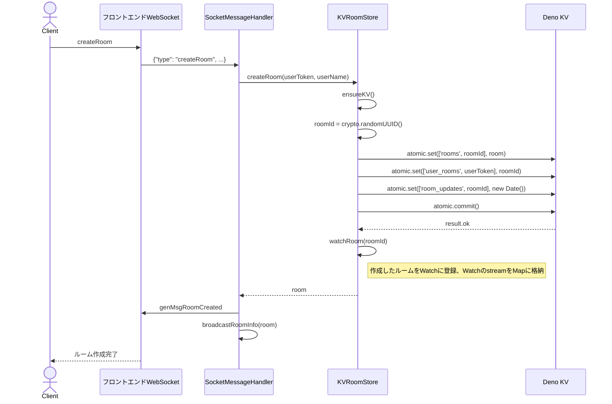
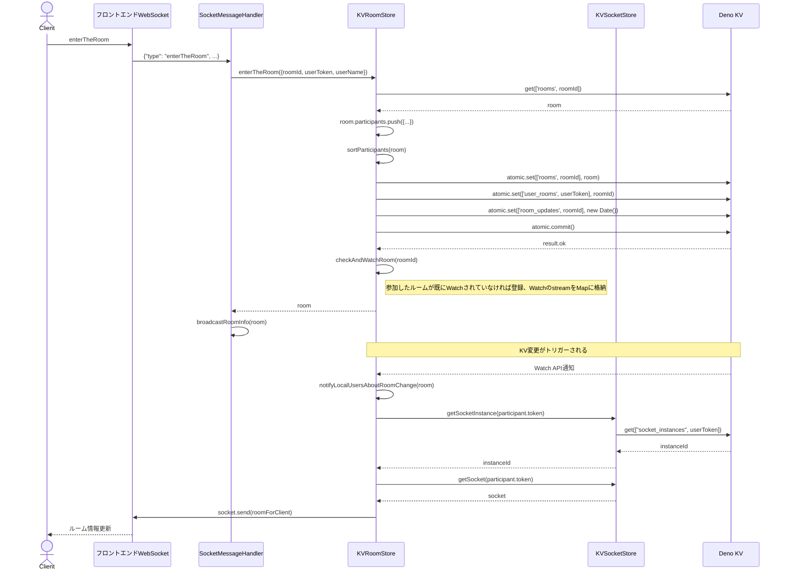
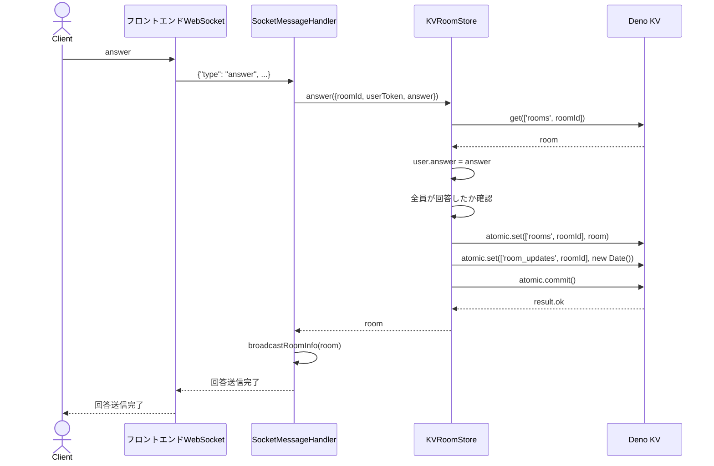
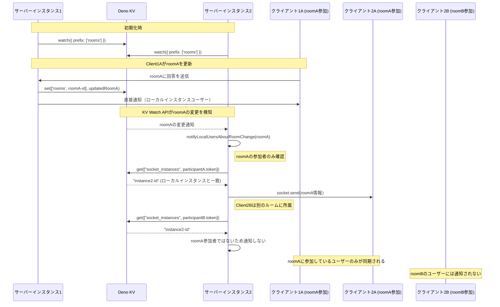
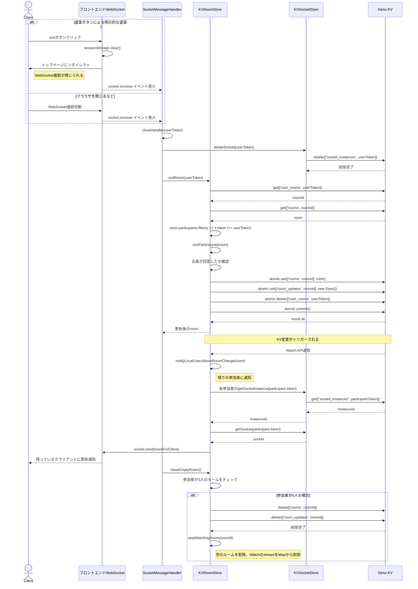
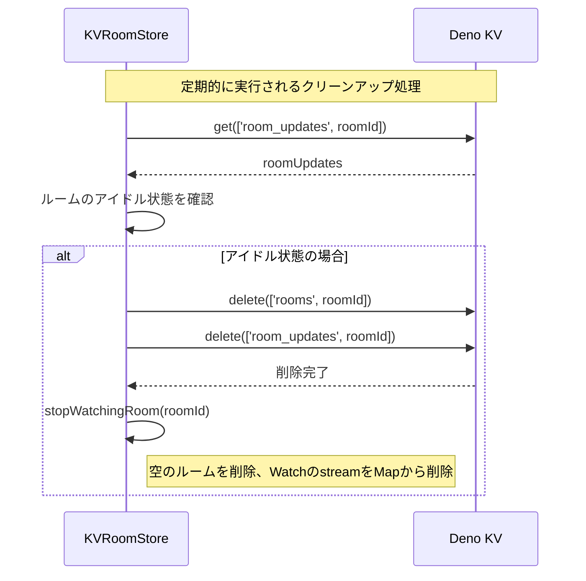

# 図

## 仕組み

- KV ストアを使用して、ルーム情報やユーザーの状態を管理
- WebSocket を使用して、リアルタイムでの通知を実現
- Deno KV の Watch API を使用して、複数インスタンス間でのデータ同期を実現
- SocketMessageHandler が WebSocket メッセージを処理し、KVRoomStore と連携
- KVRoomStore がルーム情報を管理し、Deno KV にデータを保存
- KVSocketStore がソケットインスタンスを管理し、ユーザーに通知
- SocketMessageHandler がルーム情報をブロードキャスト
- フロントエンド WebSocket がクライアントと通信
- クライアントは、ルーム作成、参加、回答送信などの操作を行う
- 各インスタンスは、KV ストアの Watch API を使用して、他のインスタンスからの変更通知を受け取る
- ルームの参加者は、他の参加者の状態をリアルタイムで確認できる

## KV ストアデータスキーマ

KV ストアには以下のデータが保存されています。各エントリは特定の目的を持ち、アプリケーションの状態管理に使用されます。

### 1. ルーム情報

| キー              | 値   | 説明                                                           |
| ----------------- | ---- | -------------------------------------------------------------- |
| ["rooms", roomId] | Room | ルーム情報オブジェクト。参加者リスト、ルームの状態などを含む。 |

```typescript
// Roomオブジェクトの構造
interface Room {
  id: RoomId;
  participants: {
    token: UserToken;
    name: string;
    answer: string;
  }[];
  isOpen: boolean;
}
```

### 2. ユーザーとルームの関連付け

| キー                      | 値     | 説明                                        |
| ------------------------- | ------ | ------------------------------------------- |
| ["user_rooms", userToken] | RoomId | 特定のユーザーが現在参加しているルームの ID |

### 3. ルーム更新タイムスタンプ

| キー                     | 値   | 説明                                                                       |
| ------------------------ | ---- | -------------------------------------------------------------------------- |
| ["room_updates", roomId] | Date | ルームが最後に更新された日時。アイドル状態のルームのクリーンアップに使用。 |

### 4. ソケットインスタンスマッピング

| キー                            | 値     | 説明                                                                                            |
| ------------------------------- | ------ | ----------------------------------------------------------------------------------------------- |
| ["socket_instances", userToken] | string | ユーザーが接続しているサーバーインスタンスの ID。複数サーバーインスタンス間での通知制御に使用。 |

## Watch について

同一ルームの参加者が別々のサーバーインスタンスに接続することがある。この場合サーバーは別々のメモリを参照することになるため、KV を使用して、ルームの状態を同期する必要がある。
そこで、KV ストアの Watch API を使用して、ルーム情報の変更を監視する。

### Watch が見るもの

- ルーム情報

### Watch を登録するタイミング

- ルーム作成時
- ルーム参加時

### Watch によって更新を検知するタイミング

- 回答時
- メンバーの参加・退出時

### Watch の管理

- Map<roomId, stream> で管理
- ルーム参加時に、既に Watch されている場合は、登録しない
- ルーム退出時に、参加者が 0 人になった場合は、Watch を解除する

## KVRoomStore のシーケンス図

### 1. ルーム作成のフロー



### 2. ルーム参加のフロー



### 3. 回答送信のフロー



### 4. KV Watch による複数インスタンス間の同期フロー

以下が起きたとき、当該 room の wacth を登録する

- そのインスタンスでユーザーが room を作成した
- いずれかのインスタンスでユーザーが room に参加した



### 5. ユーザー退出のフロー



### 6. ルームのクリーンアップ



これらのシーケンス図は、KVRoomStore の主要な処理フローと、複数インスタンス間での同期メカニズムを視覚的に表現しています。特に、KV Watch API を使用した同期の仕組みが重要です。

**図の解説：**

1. **ルーム作成フロー**：ユーザーがルームを作成するときの一連の処理を示しています。KV ストアを使用してルーム情報が保存されます。

2. **ルーム参加フロー**：ユーザーがルームに参加する際の処理と、他の参加者への通知を示しています。

3. **回答送信フロー**：ユーザーが回答を送信する際の処理を示しています。

4. **KV Watch 同期フロー**：異なるサーバーインスタンス間でのデータ同期の仕組みを示しています。KV Watch API を使用して、あるインスタンスの変更が他のインスタンスに伝搬される様子を表現しています。

### KV ストアの特徴

- **原子的操作**: トランザクションを使用して複数のキーを原子的に更新
- **分散環境対応**: 複数のサーバーインスタンスでデータを共有
- **Watch API**: キーの変更を監視して、リアルタイムでの同期を実現

### KV ストアの使用パターン

1. **ルーム作成時**:

   - ルーム情報
   - ユーザーとルームの関連付け
   - ルーム更新タイムスタンプの設定

2. **ルーム参加時**:

   - 既存のルーム情報を更新
   - 新しいユーザーとルームを関連付け
   - ルーム更新タイムスタンプの更新

3. **回答送信時**:

   - ルーム情報を更新（ユーザーの回答を保存）
   - ルーム更新タイムスタンプの更新

4. **ユーザー退出時**:
   - ルーム情報を更新（ユーザーを削除）
   - ユーザーとルームの関連付けを削除
   - ルーム更新タイムスタンプの更新
